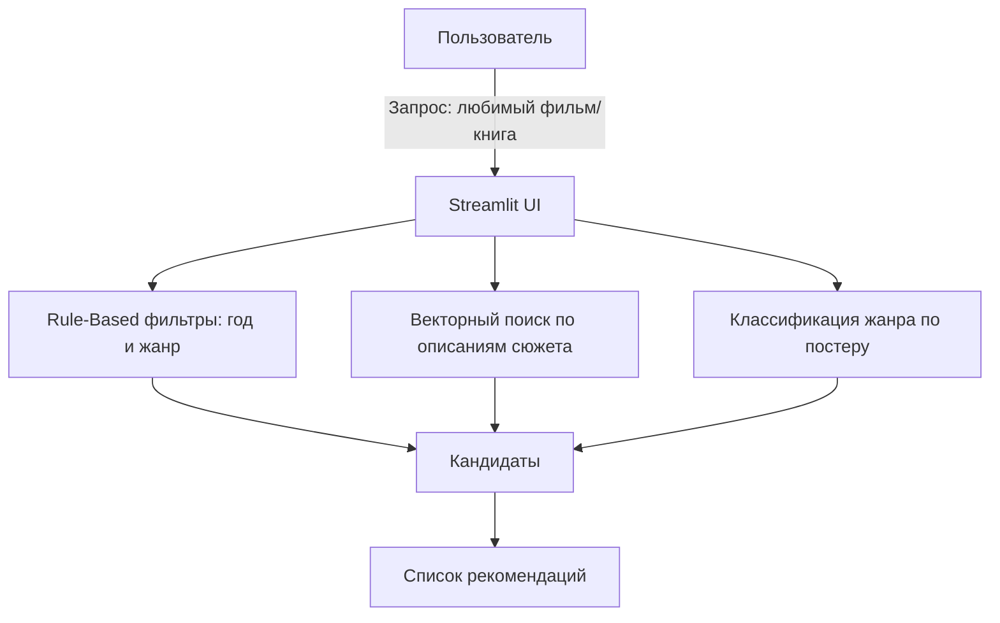

# StoryGuide

## Тема проекта
Кино/Книги (Советчик)

## Описание проекта
`StoryGuide` — интеллектуальный советчик, который рекомендует похожие фильмы/книги по интересам пользователя.

Основной сценарий: пользователь пишет, что ему нравится (например, «Мне нравится Матрица»), а система предлагает близкие варианты (например, «Начало»).

## Задачи
1. Фильтры:
- Правила по году и жанру.
2. Анализ сюжета:
- Поиск похожих фильмов по смыслу описания.
3. Жанр по постеру:
- Классификация: драма или ужасы.

## Цель
Подбирать похожие фильмы/книги с помощью правил и векторного поиска.

## Датасеты
1. IMDB Dataset of 50K Movie Reviews:
- https://kaggle.com/datasets/lakshmi25npathi/imdb-dataset-of-50k-movie-reviews
2. Movie Genre from its Poster:
- https://kaggle.com/datasets/neha1703/movie-genre-from-its-poster

## Интеграция
- Векторный поиск (`Embeddings`) для подбора похожих рекомендаций.

## UI-сценарий
`Мне нравится Матрица` -> `Совет: посмотрите Начало`

## Архитектурная схема


## Структура проекта
```text
StoryGuide/
├── .gitignore
├── README.md
├── requirements.txt
├── src/
│   ├── __init__.py
│   └── main.py
├── data/
│   ├── raw/
│   └── processed/
├── notebooks/
└── docs/
```

## Запуск проекта
```bash
python -m venv venv
venv\Scripts\activate
pip install -r requirements.txt
streamlit run src/main.py
```
