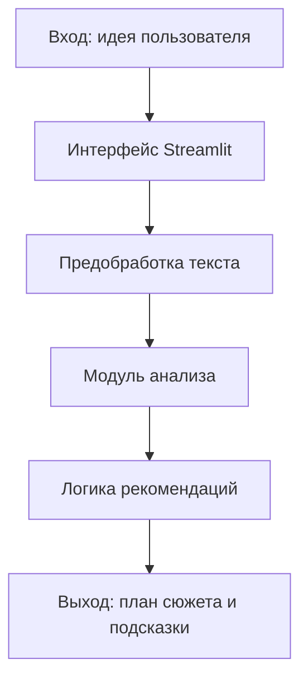

# StoryGuide

## Тема проекта
Интеллектуальная система поддержки сценариста: генерация и развитие сюжетных идей.

## Описание проекта
`StoryGuide` помогает пользователю формировать структуру истории на основе короткого запроса.

Проблема: начинающему автору сложно быстро перейти от общей идеи к связному плану сюжета.

Решение: система принимает ввод пользователя, анализирует контекст и возвращает структурированные рекомендации: персонажи, сюжетные ветки, сцены и дальнейшие шаги.

## Технологический стек
- Python 3.11+
- Streamlit
- pandas
- OpenCV (`opencv-python-headless`)
- Jupyter Notebook

## Архитектурная схема


## Структура проекта
```text
StoryGuide/
├── .gitignore
├── README.md
├── requirements.txt
├── src/
│   ├── __init__.py
│   └── main.py
├── data/
│   ├── raw/
│   └── processed/
├── notebooks/
└── docs/
```

## Запуск проекта
```bash
python -m venv venv
venv\Scripts\activate
pip install -r requirements.txt
streamlit run src/main.py
```

## Примечание по Git
Папки `venv/`, `.venv/` и `data/` добавлены в `.gitignore`, чтобы в репозиторий не попадали окружение и датасеты.
