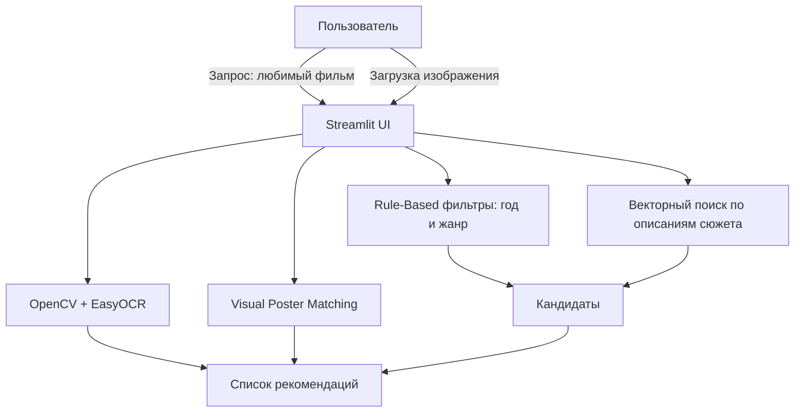

# StoryGuide

## Тема проекта
Кино (Советчик)

## Описание проекта
`StoryGuide` — интеллектуальный советчик, который рекомендует похожие фильмы по интересам пользователя и умеет анализировать визуальный контент по теме кино.

Основной сценарий: пользователь пишет, что ему нравится (например, «Мне нравится Матрица»), а система предлагает близкие варианты (например, «Начало»).

## Задачи
1. Фильтры:
- Правила по году и жанру.
2. Анализ сюжета:
- Поиск похожих фильмов по смыслу описания.
3. Жанр по постеру:
- Классификация: драма или ужасы.
4. Computer Vision:
- Загрузка постера фильма или изображения с текстом о фильме.
- OCR через EasyOCR и предобработка через OpenCV.
- Извлечение названия, жанровых подсказок и формирование запроса для рекомендаций.

## Цель
Подбирать похожие фильмы с помощью правил и векторного поиска, а также извлекать данные из изображений.

## Датасеты
1. IMDB Dataset of 50K Movie Reviews:
- https://kaggle.com/datasets/lakshmi25npathi/imdb-dataset-of-50k-movie-reviews
2. Movie Genre from its Poster:
- https://kaggle.com/datasets/neha1703/movie-genre-from-its-poster
3. The Movies Dataset:
- https://www.kaggle.com/datasets/rounakbanik/the-movies-dataset
4. MovieLens 25M:
- https://grouplens.org/datasets/movielens/25m/

Датасеты подключены в рабочую логику проекта:
- `data/raw/MovieGenre.csv` используется как основной каталог фильмов, жанров и рейтингов для поиска и рекомендаций.
- `data/raw/IMDB Dataset.csv` используется для анализа тональности англоязычных отзывов и текстовых вложений.
- `data/raw/movies_metadata.csv`, `credits.csv`, `keywords.csv` обогащают фильмы описаниями, ключевыми словами, актерами и режиссерами.
- `data/raw/ml-25m/...` добавляет пользовательские рейтинги, теги и связи `movieId -> imdbId/tmdbId`.
- `data/raw/FullMoviePosters/...` используется для визуального сопоставления постеров с фильмами из каталога.

## Интеграция
- Векторный поиск (`Embeddings`) для подбора похожих рекомендаций.
- OpenCV для предобработки постеров и страниц с описанием фильмов.
- EasyOCR для распознавания названий фильмов и связанного текста.
- `MovieGenre.csv` как базовый каталог фильмов.
- `The Movies Dataset` для `overview`, `tagline`, `keywords`, `cast`, `director`.
- `MovieLens 25M` для `ratings`, `tags`, `movieId/imdbId/tmdbId`.
- `FullMoviePosters` для визуального распознавания загруженного постера по самому изображению.
- `IMDB Dataset.csv` для анализа тональности отзывов.
- `data/processed/merged_movie_metadata.pkl` как объединенный кэш метаданных.
- `data/processed/text_search_index.pkl` как текстовый индекс по `overview + keywords + cast + director + tags`.
- `data/processed/poster_index.pkl` как визуальный индекс постеров.

Основной recommendation flow идет через объединенный каталог фильмов, собранный из `MovieGenre.csv`, `The Movies Dataset` и `MovieLens 25M`, без legacy-графовой логики.

## UI-сценарий
`Мне нравится Матрица` -> `Совет: посмотрите Начало`

`Прикрепить постер в чат` -> `Отправить сообщение` -> `Получить OCR и рекомендацию`

## Неделя 7. Computer Vision
- Тема: OCR и классификация изображений.
- Реализация: OpenCV + EasyOCR без fallback-режима.
- Поддерживаемые типы входа: постер фильма, изображение с текстом о фильме.
- Результат: система обрабатывает не только текстовые запросы, но и визуальный контент по теме кино, включая сопоставление постера с фильмом из датасета.

## Неделя 8. Гибридные методы и рекомендации
- Тема: векторные представления и метрики близости.
- Реализация: гибридный поиск `Cosine Similarity + Fuzzy matching`.
- Сценарий под тему проекта: найти фильм по описанию сюжета, неточному названию или смешанному запросу.
- Результат: StoryGuide умеет подбирать похожие фильмы не только по явному совпадению названия, но и по смыслу описания.

Ограничение текущих датасетов:
- Локальный индекс покрывает `28847` постеров из `39515` фильмов каталога.
- Текстовый индекс покрывает `40108` фильмов и `122117` уникальных токенов описаний.
- Постеры покрывают именно афиши, а не кадры из фильма.
- Поэтому постер распознать можно по самому изображению, а произвольный скриншот из фильма надежно определить нельзя без отдельного датасета кадров или обученной visual model.

## Архитектурная схема

```mermaid
graph TD;
    A[Пользователь] -->|Запрос: любимый фильм| B[Streamlit UI];
    A -->|Загрузка изображения| B;
    B --> C[Rule-Based фильтры: год и жанр];
    B --> D[Векторный поиск по описаниям сюжета];
    B --> E[OpenCV + EasyOCR];
    B --> H[Visual Poster Matching];
    C --> F[Кандидаты];
    D --> F;
    E --> G[OCR + название + тип визуального контента];
    H --> G[Фильм из датасета по постеру];
    F --> G[Список рекомендаций];
```

## Структура проекта
```text
StoryGuide/
├── .gitignore
├── README.md
├── requirements.txt
├── src/
│   ├── __init__.py
│   ├── main.py
│   ├── dataset_loader.py
│   ├── logic.py
│   ├── movie_recommender.py
│   ├── poster_matcher.py
│   └── vision_processor.py
├── data/
│   ├── raw/
│   └── processed/
├── notebooks/
└── docs/
```

## Запуск проекта
```bash
python -m venv venv
venv\Scripts\activate
pip install -r requirements.txt
streamlit run src/main.py
```

## Что умеет система сейчас
- Принимать текстовые запросы по фильмам.
- Сохранять историю диалога по `sid`.
- Прикреплять постеры и текстовые файлы прямо в чат.
- Распознавать название, жанровые подсказки и тип визуального контента.
- Определять фильм по самому постеру из локального полного индекса постеров, даже если OCR-текст слабый.
- Формировать готовый запрос в StoryGuide по результату OCR.
- Подбирать фильмы из объединенного каталога `MovieGenre + The Movies Dataset + MovieLens 25M`.
- Анализировать тональность англоязычных отзывов по `IMDB Dataset.csv`.
- Выполнять гибридный поиск по описанию, ключевым словам, тегам и названию через `Cosine Similarity + Fuzzy matching`.
- Рекомендовать похожие фильмы напрямую из `MovieGenre.csv`, когда пользователь пишет, что ему нравится.
